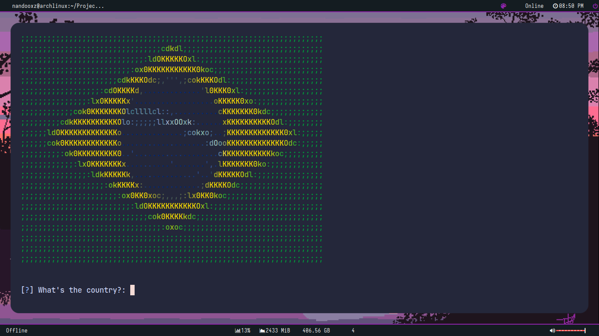
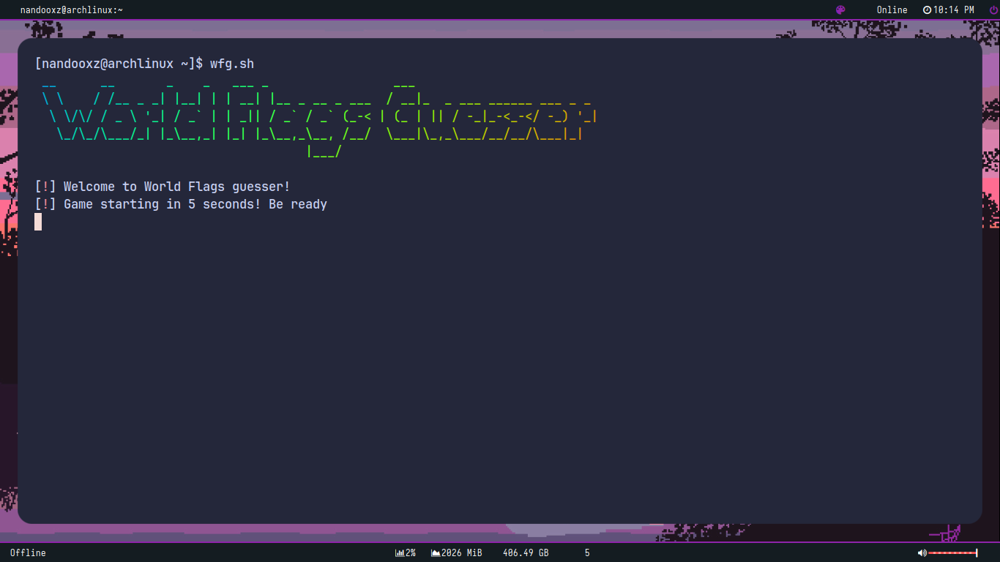
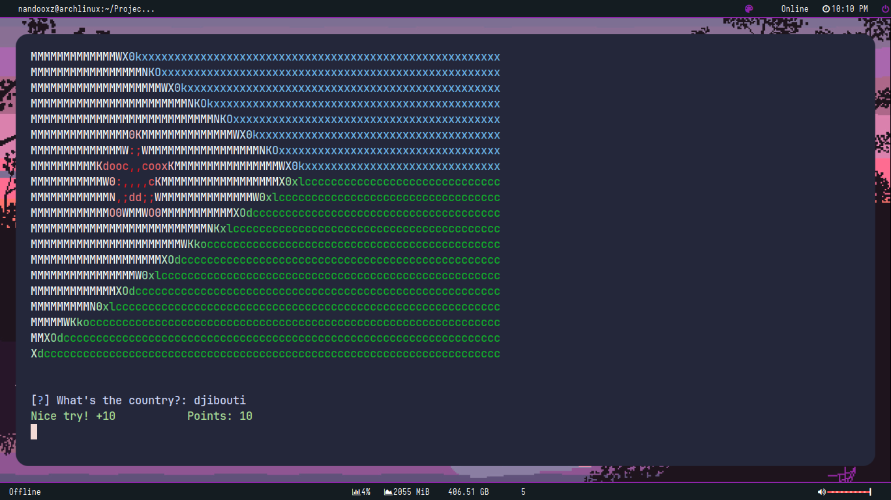
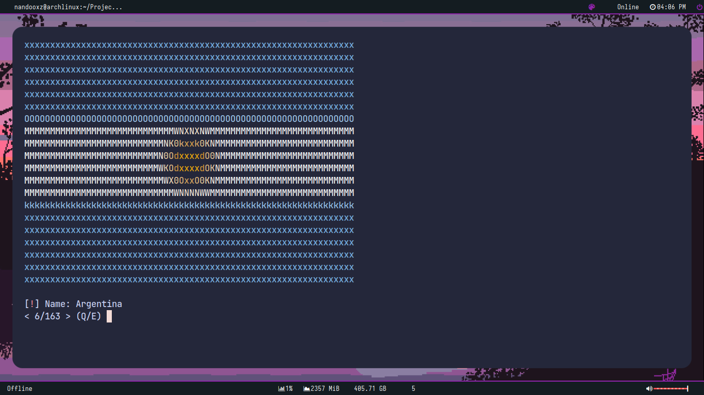

<div align=center>
<h3 align="center"></img></h3>
<p align="center">A simple Geography terminal-game for Arch Linux using REST Countries API</p>

<a href="https://www.python.org/"></a>
<a href="https://archlinux.org"></a>
<a href="LICENSE"></a>
</div>

<br/>

# Demonstration


______________________________________

# Instalation

If you're in Arch, you can use the `install.sh` setup on the repository to install the game:

```
git clone https://github.com/nandooxzz/world-flags-guesser.git
cd world-flags-guesser
chmod +x install.sh
./install.sh
```
<br/>

If you are on **another distro**, try to install by installing the packages and copying the files (using AUR helper):

```
git clone https://github.com/nandooxzz/world-flags-guesser.git
yay -S lolcat jp2a python3 python-colorama python-requests
cd world-flags-guesser

sudo mkdir -p /usr/share/world-flags-guesser
sudo cp -r {src/title.txt,src/uninstall.sh} /usr/share/world-flags-guesser
cd /bin && sudo chmod +x ./wfg

```

# Uninstaling

To uninstall, just run this command on your terminal:

```
sudo /usr/local/share/world-flags-guesser/uninstall.sh
```

________________________

# Usage

After installing, try running `wfg` on the console. Done, Now you can play the game!

Wait 5 seconds and guess the countries by their flags displayed on your terminal. The games ends when you hit **100 points**! But, if you reach **0 points** you loose.

## Main Commands

### **--help, -h**
* Display a help message for World Flags Guesser's command `wfg -h``

### **--list, -l**
* Enter **list** mode, displaying each one of all countries in the world, with their names. `wfg.sh -l`

________________________

# Screenshots
<div align=center>



<br/>



<br/>



</div>

________________________

# Contribution

Feel free to open issues, make forks/pull requests if you see some bugs and/or try to correct them. See <a href="CONTRIBUTING.md">CONTRIBUTING.md</a> for more details.